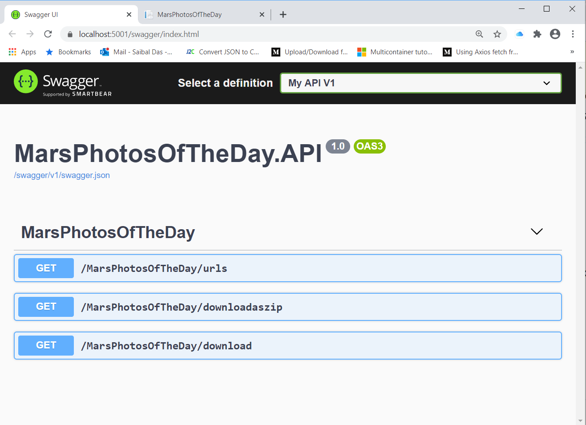
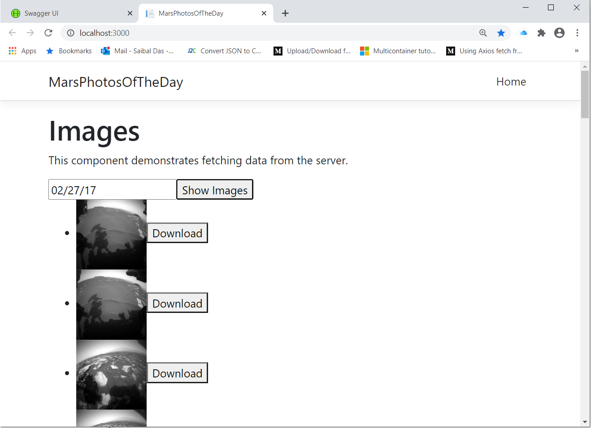

# MarsPhotosOfTheDay
MarsPhotosOfTheDay

1) Open the solution in Visual Studio 2019,
2) Select MarsPhotosOfTheDay.AIP as the Startup project
3) Select IIS Express as the profile to debug and click the debugger button,
4) Swagger will open. You can now execute the APIs
5) Added Docker support to the WebAPI project. Run with Docker Compose
6) Added Web Browser support to display images
   Start the WebApi project using docker compose
   Go to the Web Project
     Open in Visual Studio Code and then npm install & npm start
        Browser opens localhost:5000 with MarsRoverImages
  I am adding the Web Browser support to download the images locally

